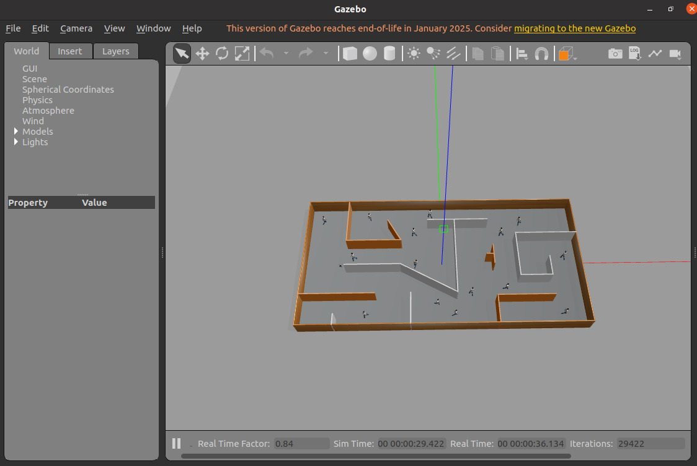
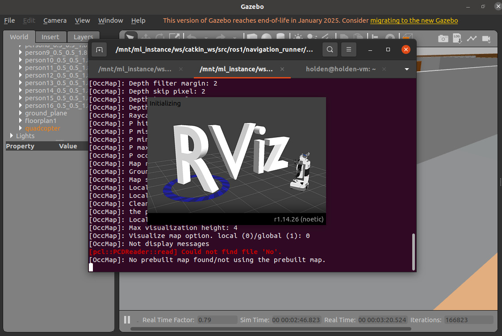
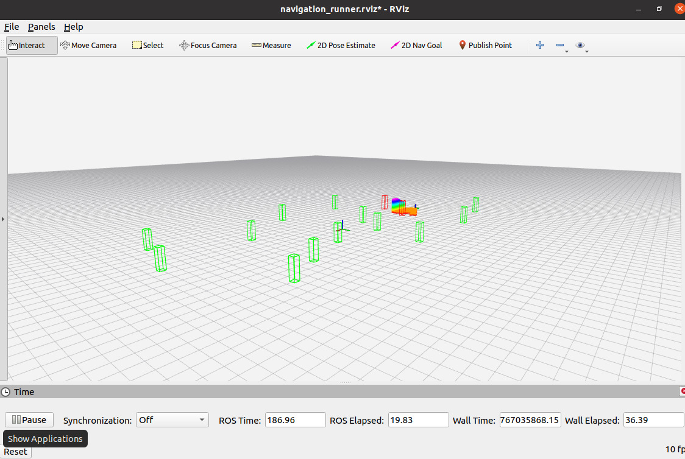
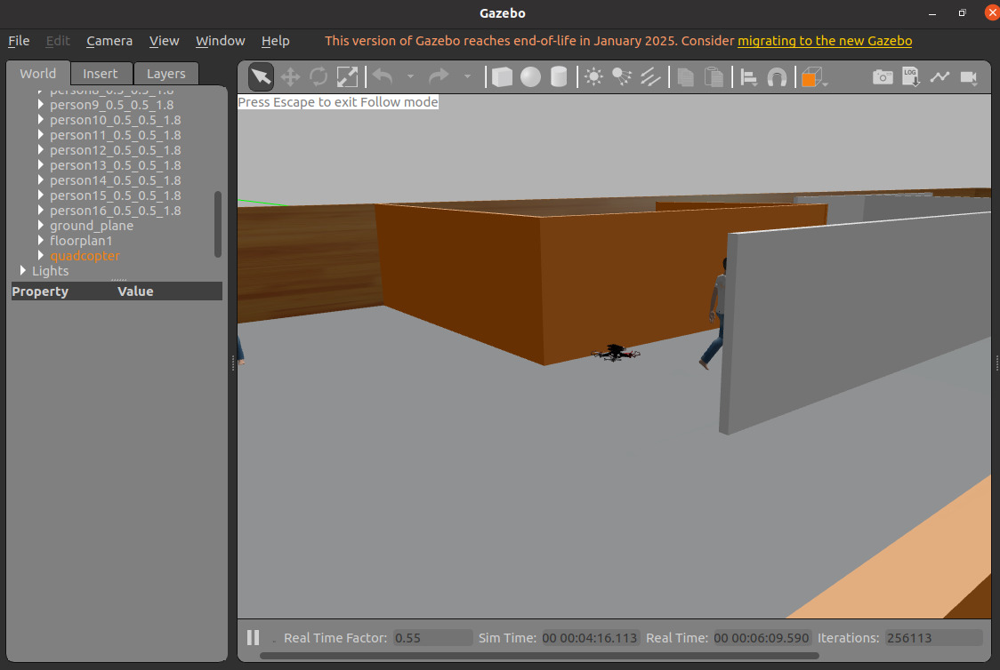
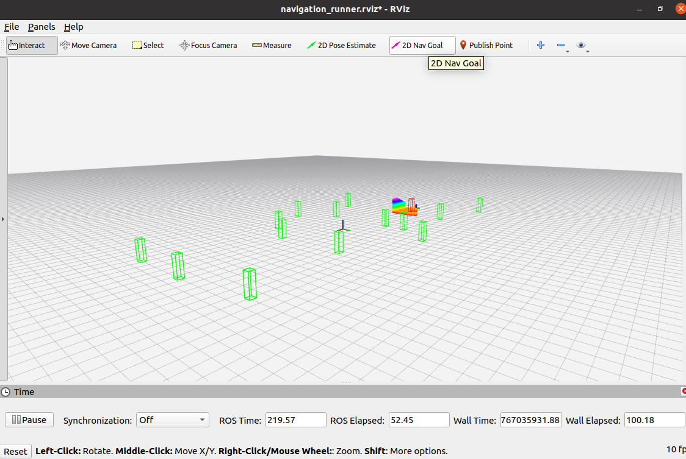
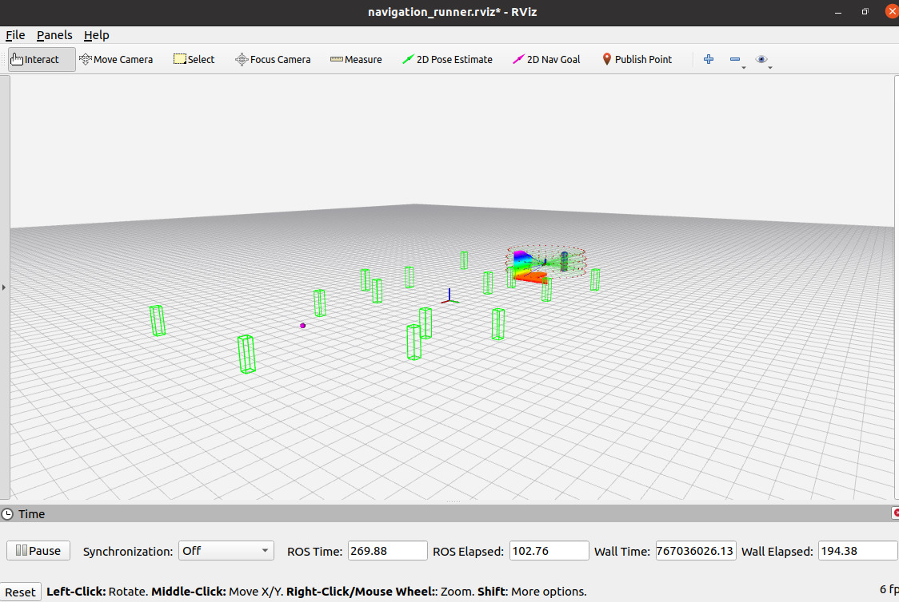
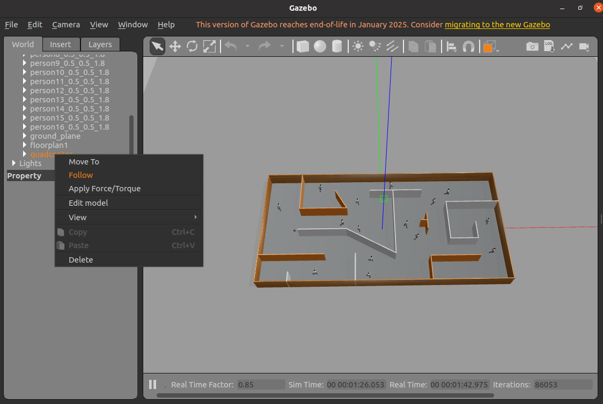

# PROJECT 2 - NavRL on ROS1 inside Ubuntu 20.04 LTS Virtual Machine
**Technical Documentation**

# Video Demonstration - 2D Nav Goal

<div style="max-width: 100%; margin: 1.5em 0; text-align: center;">
  <video controls style="width: 100%; height: auto; border-radius: 10px; box-shadow: 0 4px 12px rgba(0,0,0,0.2);">
    <source src="_static/videos/navrl.mp4" type="video/mp4">
    Your browser does not support the video tag.
  </video>
</div>

# Chapter 1: NavRL on ROS1 inside Ubuntu 20.04 LTS Virtual Machine

This document is a full technical tutorial that explains, in detail, how we successfully set up NavRL on ROS1 inside an Ubuntu 20.04 LTS virtual machine, launched Gazebo and RViz, and reached a working state where the navigation runner responds to 2D Nav Goals in RViz. The document is written as a practical guide first, but it also preserves the real process we went through. All major failures, misleading errors, wrong assumptions, and environment conflicts are documented so that the reader understands not only what works, but also what does not and why.

## Why This Setup Exists and What We Are Actually Building

NavRL is a ROS1 based reinforcement learning navigation framework. It relies on ROS Noetic, Gazebo for simulation, RViz for visualization, and PyTorch based PPO for control logic. These components were not designed independently. They assume a very specific operating system, Python version, and runtime model.

The final goal of this setup is simple to describe but hard to reach if the environment is wrong. We want Gazebo running a simulated environment, RViz visualizing the robot, map, and costmaps, and NavRL’s navigation runner accepting a 2D Nav Goal from RViz and producing motion through a PPO policy. Anything short of that means the system is not actually working.

## Why Ubuntu 20.04 LTS Is Mandatory

The very first hard constraint is the operating system. ROS Noetic officially targets Ubuntu 20.04 LTS. It depends on system libraries, compiler versions, and Python 3.8. Running the same code on Ubuntu 22.04 introduces silent incompatibilities that do not always fail loudly. Some nodes launch, others crash, and some appear to work while producing incorrect behavior.

This is why the entire effort eventually moved into a clean Ubuntu 20.04 LTS virtual machine. Not because virtual machines are ideal, but because they allow precise control over the OS version.

You can confirm the OS version at any time using:

```bash
lsb_release -a
```

If this command does not report Ubuntu 20.04 LTS, stop immediately. Continuing on a newer version wastes time.

## The First Failed Path: Headless Ubuntu 20.04 over SSH

Before the virtual machine approach, we attempted to run NavRL on a remote Ubuntu 20.04 LTS server accessed only via SSH. The idea was to run everything headless and avoid local resource usage.

In practice, this failed for structural reasons. Gazebo and RViz are not optional tools in NavRL. Even if Gazebo can technically run in server mode, NavRL’s debugging, validation, and interaction model assumes real-time visualization.

On the headless server, Gazebo frequently stalled during startup. A common state looked like this:

```text
[Msg] Waiting for master.
[Msg] Connected to gazebo master @ http://127.0.0.1:11345
Preparing your world...
```

At the same time, PX4 SITL often blocked with:

```text
INFO  [simulator_mavlink] Waiting for simulator to accept connection on TCP port 4560
```

MAVROS behavior was inconsistent. In some cases it launched and stayed alive. In other cases it exited immediately after launch with no meaningful error beyond a clean shutdown.

RViz could not be used properly at all. Without a display server, even launching RViz required X11 forwarding. When attempted, Gazebo GUI either failed to open or crashed immediately with OpenGL and Vulkan related errors referencing missing libGL or EGL contexts.

Even when a window appeared, performance was unstable and input lag made interaction unusable. More importantly, debugging was impossible. Without RViz, there was no way to confirm TF trees, costmaps, laser scans, or navigation goals.

This led to an important conclusion. Headless execution might be acceptable for training or batch runs, but it is not viable for initial setup or debugging. Visualization is not optional during development.

## Moving to a Local Ubuntu 20.04 Virtual Machine

The decision was made to move to a local virtual machine with a full desktop environment. VirtualBox was used. During installation, there were cases where clicking Finish in the Ubuntu installer produced no result. This was traced back to a mismatch between the VirtualBox version and its extension pack.

Once the extension pack version was aligned with the VirtualBox installation, Ubuntu 20.04 LTS installed normally.

After installation, the system was updated but not upgraded across releases. It is critical to avoid accidental distribution upgrades.

## Installing ROS Noetic Cleanly

ROS Noetic was installed using the official ROS repositories for Ubuntu 20.04. 

```bash
sudo curl -sSL https://raw.githubusercontent.com/ros/rosdistro/master/ros.key | sudo apt-key add -
sudo sh -c 'echo "deb http://packages.ros.org/ros/ubuntu $(lsb_release -sc) main" > /etc/apt/sources.list.d/ros-latest.list'
```

Also, we need to install ROS Noetic Desktop.

```bash
sudo apt update
sudo apt install -y ros-noetic-desktop-full
```

Once installed, ROS **MUST** be sourced in every terminal session. This is very critical because in every parallel terminal session, we **MUST** source ROS since the entire pipeline is running on ROS1.

```bash
source /opt/ros/noetic/setup.bash
```

To avoid forgetting this, it was added to the shell startup file:

```bash
echo "source /opt/ros/noetic/setup.bash" >> ~/.bashrc
```

You can verify that ROS is functional by running:

```bash
roscore
```

If roscore runs without errors, the base ROS installation is correct.

## Creating the Catkin Workspace and Fixing Permission Errors

A catkin workspace was created inside the home directory:

```bash
mkdir -p ~/catkin_ws/src
cd ~/catkin_ws
catkin_make
```

Initially, this step failed with permission errors such as:

```text
[Errno 13] Permission denied: '/home/user/catkin_ws/build'
```

This error was not caused by ROS itself. It happened because the workspace path was accidentally symlinked to a mounted directory with restricted permissions. The fix was to ensure that the entire workspace lived directly under the VM user’s home directory.

After fixing this, the workspace was rebuilt successfully.

Every terminal that interacts with ROS **MUST** source the workspace:

```bash
source ~/catkin_ws/devel/setup.bash
```

Forgetting this step caused multiple downstream errors that looked unrelated at first.

## Cloning NavRL and Avoiding the Wrong Repository

One major source of confusion was the existence of multiple repositories with similar names. At one point, the wrong repository was cloned, leading to incorrect assumptions about ROS2, NVIDIA Omniverse, and unrelated dependencies.

After verifying the correct NavRL repository, it was cloned into the catkin workspace source directory and built:

```bash
cd ~/catkin_ws/src
git clone https://github.com/Zhefan-Xu/NavRL
cd ~/catkin_ws
catkin_make
```

Build errors at this stage usually indicated missing ROS dependencies, which were resolved through apt.

## Gazebo Launch Failures and Argument Conflicts

Launching Gazebo initially produced confusing errors. One recurring message was:

```text
RLException: Invalid <arg> tag: cannot override arg 'world_name', which has already been set
```

This error occurred because the launch file already defined `world_name`, and we attempted to override it from the command line. The fix was simply to inspect the launch file and remove the redundant override.

Another common failure mode was Gazebo appearing to hang indefinitely. In almost every case, this was caused by not sourcing either the ROS environment or the catkin workspace in that terminal.

Once both environments were sourced consistently, Gazebo launched reliably.

## Installing RViz and Confirming Visualization

RViz was not always present by default. Attempting to launch it sometimes resulted in a command not found error or an empty visualization window.

Installing RViz explicitly resolved this:

```bash
sudo apt install ros-noetic-rviz
```

When RViz first launched successfully, it showed empty frames. This was expected. Once the NavRL stack was running, TF frames, robot models, maps, and costmaps appeared. This was a critical validation step.

## PyTorch and TorchRL: The Most Difficult Part

The most time-consuming part of the setup involved PyTorch and TorchRL. NavRL depends on TorchRL, which itself depends on specific PyTorch versions and Python features.

Ubuntu 20.04 ships with Python 3.8. Many modern PyTorch wheels assume Python 3.9 or newer. This mismatch produced errors such as:

```text
ERROR: Package 'typing-extensions' requires a different Python: 3.8.10 not in '>=3.9'
```

and warnings like:

```text
failed to import functorch
```

These issues caused the navigation runner to crash immediately with stack traces inside TorchRL modules such as `ProbabilisticActor`.

The key mistake early on was trying to force system Python to behave like a modern ML environment. The correct solution was to isolate the ML stack entirely.

A dedicated Python environment was created that supported compatible versions of PyTorch and TorchRL. Once this environment was activated before running NavRL, the import errors disappeared and the navigation runner started correctly.

## Running the Navigation Runner Successfully

With ROS, Gazebo, RViz, and the Python environment all configured correctly, the navigation runner was launched.

At this stage, previous errors such as immediate process termination, missing imports, or silent crashes no longer occurred.

When a 2D Nav Goal was set in RViz, the robot finally responded. This confirmed that sensor topics, TF, costmaps, and PPO control were all wired correctly.

In some cases, the robot took off or hovered without translating. This behavior was related to policy behavior and not a system configuration error.

## Final Working State and What It Means

The final working setup consists of a local Ubuntu 20.04 LTS virtual machine with ROS Noetic installed system-wide, NavRL built inside a clean catkin workspace, Gazebo and RViz running locally with full GUI support, and a dedicated Python environment handling PyTorch and TorchRL.

The defining success condition is simple. Gazebo runs without hanging. RViz shows the robot, map, and costmaps. The navigation runner starts without crashing. A 2D Nav Goal in RViz produces motion.

Anything less than this means the system is not fully operational.

## Closing Notes

This setup is fragile because it lives at the intersection of robotics middleware, simulation, and modern reinforcement learning tooling. Small deviations in OS version, Python version, or environment isolation can break it in non-obvious ways.

Following this document exactly avoids most of the traps we fell into. Deviating from it should be done only with a clear understanding of the underlying dependencies.

---

# Chapter 2: NavRL with PX4 and MAVROS

In this part we talk about, in detail, how we integrated PX4, MAVROS, and NavRL, including the exact errors we encountered, the misleading states we fell into, and the concrete steps that resolved them. This is not a conceptual overview. It is a practical, failure-driven explanation of how PX4 SITL, MAVROS, Gazebo, and NavRL actually behave together on Ubuntu 20.04.

## Why PX4 and MAVROS Are Present in the NavRL Stack

Early on, we assumed PX4 was optional in simulation. This assumption caused days of confusion. NavRL does not directly control the UAV model in Gazebo. It assumes a PX4-style flight controller pipeline. PX4 handles flight state, constraints, and low-level interpretation of motion commands. MAVROS is the ROS-facing bridge that translates between ROS messages and MAVLink.

Once this is understood, the errors encountered later start to make sense.

## Error Case One: PX4 Waiting Forever for the Simulator

One of the most common and confusing states appeared immediately after launching PX4 SITL. The PX4 terminal looked alive but stuck. The output typically ended with something like:

```text
INFO  [simulator_mavlink] Waiting for simulator to accept connection on TCP port 4560
```

At first, this looked like PX4 was frozen or broken. In reality, PX4 was doing exactly what it was designed to do. It was waiting for a MAVLink simulator endpoint.

The mistake was launch order. PX4 was started before Gazebo had initialized its MAVLink interface. As a result, PX4 waited indefinitely.

The fix was not a code change. The fix was launch order discipline. Gazebo, through the UAV simulator launch file, **MUST** be started first. PX4 should only be launched after Gazebo is fully up and running.

When the order was corrected, this message disappeared without any further changes.

## Error Case Two: MAVROS Starts Then Immediately Exits

Another highly misleading failure involved MAVROS. We repeatedly saw MAVROS launch successfully and then shut itself down almost immediately. The terminal output often looked clean, with no obvious fatal error.

In some cases, the last visible lines looked like this:

```text
started roslaunch server http://localhost:XXXXX/
SUMMARY
========
CLEAR PARAMETERS
 * /mavros/
PARAMETERS
```

Then the process exited.

This behavior was caused by an incorrect FCU URL configuration. MAVROS exits cleanly when it cannot establish a valid MAVLink connection. It does not crash loudly.

We experimented with several FCU URLs, including:

```text
udp://:14540@14557
udp://127.0.0.1:14540@
```

Using mismatched ports or protocols caused MAVROS to exit immediately.

The fix was to ensure that PX4 and MAVROS were using compatible transport and port settings. Once the FCU URL matched what PX4 was actually listening on, MAVROS stayed alive.

## Error Case Three: Gazebo Running, PX4 Running, No Motion

A particularly frustrating state occurred when Gazebo was running correctly, PX4 SITL was running, MAVROS was alive, and RViz showed data, but the UAV did not move.

At this point, everything looked healthy from a ROS perspective. Topics existed. Nodes were running. No errors were printed.

The missing piece was NavRL. Either the navigation runner was not running, or it had crashed silently due to Python dependency issues.

When the navigation runner was launched without activating the correct Python environment, it exited immediately with errors such as:

```text
failed to import functorch
```

or

```text
ImportError: cannot import name 'ProbabilisticActor'
```

These errors occurred before any ROS interaction, which made them easy to overlook.

The fix was to activate the NavRL conda environment before launching the navigation node.

```bash
conda activate NavRL
rosrun navigation_runner navigation_node.py
```

Once this was done, the node stayed alive and began publishing commands.

## Error Case Four: Drone Takes Off But Does Not Translate

Another confusing behavior was the drone taking off automatically but refusing to move horizontally, even when 2D Nav Goals were set in RViz.

This was not a PX4 failure. PX4 was receiving valid commands, but those commands did not contain consistent lateral velocity components. From PX4’s perspective, it was executing exactly what it was told.

From NavRL’s perspective, this behavior was often related to the policy output rather than system integration.

The key realization here was that successful arming or takeoff does not imply correct navigation control.

## Error Case Five: MAVROS Topics Exist But Nothing Happens

In several runs, MAVROS topics were visible using tools like `rostopic list`, yet the UAV remained stationary.

This created the illusion that MAVROS was working correctly. In reality, MAVROS was alive but not relaying meaningful control commands to PX4.

This usually traced back to either a broken FCU connection or NavRL not publishing commands.

Again, the only reliable indicator of success was actual motion in Gazebo.

## Diagnosing Using Process Behavior Rather Than Logs

One of the hardest parts of PX4 integration was that failures were quiet. PX4 waited. MAVROS exited cleanly. NavRL crashed early in Python. Gazebo kept running.

The most reliable debugging signal was process behavior. If PX4 waited forever, it was missing a simulator connection. If MAVROS exited immediately, the FCU URL was wrong. If NavRL exited immediately, the Python environment was wrong.

Understanding these patterns reduced debugging time dramatically.

## Final Working Launch Pattern

The stable pattern that worked consistently was this. First, launch the UAV simulator and Gazebo. Second, ensure PX4 SITL is connected. Third, launch MAVROS with a correct FCU URL. Fourth, activate the NavRL Python environment and launch the navigation runner.

When this order was followed, PX4 no longer waited indefinitely, MAVROS stayed alive, and NavRL commands reached the flight controller.

---

# Chapter 3: NavRL ROS1 Deployment

This document focuses **only** on the ROS1 deployment part of NavRL and explains it in a way that matches what we actually did in practice. It is written as a companion to the official repository README, but it fills in the gaps that the README necessarily skips. The goal here is not to restate the paper or the Isaac Sim training workflow, but to explain how the ROS1 deployment really behaves on an Ubuntu 20.04 system, what assumptions it makes, where it is fragile, and how to bring it up reliably.

Everything here assumes that you are **not training** in Isaac Sim. We are strictly in deployment mode, using Gazebo, RViz, ROS1 Noetic, and a pretrained policy running through the navigation runner. This is exactly the workflow we followed.

## What the ROS1 Deployment Actually Is

The ROS1 deployment of NavRL is a bridge between three worlds that normally do not fit together cleanly. One is classic ROS1 with catkin, launch files, TF trees, and Gazebo plugins. One is modern reinforcement learning implemented in Python with PyTorch and TorchRL. The third is UAV simulation using a velocity based control interface that looks simple on paper but is sensitive to timing and initialization order.

The repository structure reflects this separation. The ROS1 side lives entirely under the `ros1` directory. This directory is not a standalone ROS package by itself. It is a collection of multiple ROS packages that expect to be placed inside an existing catkin workspace. The Python RL side is **not** built by catkin. It is executed at runtime through `rosrun` and depends on an external Python environment.

This separation is the single most important thing to understand before touching any commands. If you try to make catkin manage Python dependencies, or if you try to run the navigation runner without a proper Python environment, things will break in confusing ways.

## System Assumptions That MUST Hold

The ROS1 deployment assumes Ubuntu 20.04 LTS and ROS Noetic. It assumes Gazebo is available through ROS, not as a standalone custom build. It assumes Python 3.8 at the system level. It assumes that MAVROS is installed and available, even though we are not flying a real vehicle.

If any of these assumptions are violated, the system may still partially start, which is worse than failing immediately. You might see Gazebo but no motion, RViz but no TF, or a navigation node that starts and exits silently.

## Installing ROS1 Dependencies for NavRL

Beyond the base ROS Noetic installation, the ROS1 deployment requires MAVROS. This is explicitly stated in the repository, but the reason is often not obvious. The UAV simulator uses MAVROS message types and interfaces internally, even in pure simulation.

Install MAVROS and its related packages.

```bash
sudo apt-get update
sudo apt-get install ros-noetic-mavros*
```

If this step is skipped, catkin may still build successfully, but runtime errors will appear later when launching the simulator.

## Placing the ros1 Folder into the Catkin Workspace

The repository does not expect you to clone the entire NavRL repository into `catkin_ws/src`. Instead, only the `ros1` directory is copied.

This distinction matters. The Python code lives outside catkin. The ROS launch files and simulator packages live inside catkin.

From the NavRL repository root, copy the `ros1` directory.

```bash
cp -r ros1 ~/catkin_ws/src/
```

After copying, rebuild the workspace.

```bash
cd ~/catkin_ws
catkin_make
```

If this build fails, read the error messages carefully. Most failures here are missing ROS dependencies, not Python issues.

## Gazebo Model Path Setup and Why It Matters

One of the most subtle but critical steps in the ROS1 deployment is setting up the Gazebo model path. The UAV simulator uses custom models that are not part of the default Gazebo installation.

The repository provides a helper script called `gazeboSetup.bash`. This script modifies environment variables such as `GAZEBO_MODEL_PATH` so that Gazebo can find the UAV models and environments.

The **most common mistake** here is sourcing the wrong path. The README shows a generic path, but in practice the script **MUST** be sourced from inside the catkin workspace.

The correct form looks like this.

```bash
echo 'source ~/catkin_ws/src/ros1/uav_simulator/gazeboSetup.bash' >> ~/.bashrc
```

If you source a path that points to the NavRL repository outside the workspace, Gazebo will launch but fail to load models. This often manifests as an empty world or silent plugin failures.

After editing `.bashrc`, open a new terminal or source it manually.

```bash
source ~/.bashrc
```

## Three Parallel Terminals

The ROS1 deployment of NavRL is intentionally split across three terminals. This is not cosmetic. It reflects real runtime dependencies.

The simulator **MUST** be fully running before perception starts. Perception **MUST** be running before the navigation runner starts. Violating this order leads to nodes waiting forever or exiting immediately.

Every terminal **MUST** source ROS and the catkin workspace.

```bash
source /opt/ros/noetic/setup.bash
source ~/catkin_ws/devel/setup.bash
```

If even one terminal forgets this, that terminal will not see ROS packages and will fail in ways that look unrelated.

## Terminal One: Launching the UAV Simulator

The first terminal launches Gazebo and the UAV simulator.

```bash
roslaunch uav_simulator start.launch
```

At this point, Gazebo should open and load the environment. During our setup, we frequently saw Gazebo hang at startup with messages like:

```text
Preparing your world...
```

In practice, this almost always meant one of three things. The Gazebo model path was not set correctly. A previous Gazebo instance was still running. Or the ROS environment was not sourced in that terminal.

Once fixed, Gazebo launched reliably.

## Terminal Two: Safety and Perception Module

The second terminal launches the perception and safety stack.

```bash
roslaunch navigation_runner safety_and_perception_sim.launch
```

This launch file brings up nodes that subscribe to sensor data, process obstacle information, and publish safety related signals used by the navigation runner.

If this terminal exits immediately, it usually means the simulator is not running or required topics are missing. This is why launch order matters.

## Terminal Three: Running the Navigation Runner

The third terminal runs the PPO based navigation logic. This terminal is different from the first two. It depends on Python packages that are **not** managed by ROS.

Before running the navigation node, the NavRL conda environment **MUST** be activated.

```bash
conda activate NavRL
```

If this step is skipped, the navigation node may start and immediately exit with Python import errors related to TorchRL or PyTorch.

Once the environment is active, run the navigation node.

```bash
rosrun navigation_runner navigation_node.py
```

Earlier in our setup, this command repeatedly failed with errors such as failed imports of TorchRL modules or warnings about functorch. These failures disappeared once the correct environment was activated.

When the node runs correctly, it stays alive and begins publishing velocity commands.

## RViz Interaction and 2D Nav Goal

When all three terminals are running, RViz should either open automatically or can be launched manually.

```bash
rviz
```

In RViz, you should see TF frames, the UAV model, and environment information. Use the 2D Nav Goal tool to set a navigation target.

If the UAV responds, the deployment is working end to end.

If the UAV does not move but all nodes are running, the issue is usually policy behavior or configuration, not system setup.

---

# Chapter 4: NavRL ROS1 Ubuntu 20.04 LTS Full Setup and Run Guide

This document is a detailed, ground up setup and execution guide for running NavRL on ROS1 Noetic inside an Ubuntu 20.04 LTS environment. It is written as a practical, reproducible tutorial, but it is also honest about the problems we encountered, the exact errors we saw, and how those errors were resolved. The goal is that someone following this document does not need to guess, search forums, or experiment blindly. Everything that caused friction for us is written down here.

The final working state described in this document is very specific. Gazebo is running locally with a simulated UAV environment. RViz is running locally and shows TF frames, robot model, map, and costmaps. Three terminals are active at the same time. One runs the UAV simulator. One runs the perception and safety stack. One runs the PPO based navigation runner. When a 2D Nav Goal is set in RViz, the UAV responds.

Nothing less than this state should be considered success.

## Verifying the Operating System Before Anything Else

The entire NavRL stack assumes Ubuntu 20.04 LTS. This is not a preference. It is a dependency. ROS Noetic is built against Ubuntu 20.04 system libraries and Python 3.8. Running on Ubuntu 22.04 leads to failures that often look unrelated at first.

Before installing anything, verify the OS.

```bash
lsb_release -a
```

If the output does not clearly say Ubuntu 20.04 LTS, stop. Do not try to adapt the commands. Do not try to downgrade Python. Fix the OS first.

## Installing ROS1 Noetic From Scratch

ROS Noetic **MUST** be installed from the official ROS repositories. Installing partial ROS packages or mixing sources leads to broken environments later.

Start by preparing the system.

```bash
sudo apt update
sudo apt install -y curl gnupg lsb-release
```

Add the ROS repository and key.

```bash
sudo curl -sSL https://raw.githubusercontent.com/ros/rosdistro/master/ros.key | sudo apt-key add -
sudo sh -c 'echo "deb http://packages.ros.org/ros/ubuntu $(lsb_release -sc) main" > /etc/apt/sources.list.d/ros-latest.list'
```

Update again and install ROS Noetic.

```bash
sudo apt update
sudo apt install -y ros-noetic-desktop-full
```

If this step fails with unresolved dependencies, the base system is already inconsistent. Fix that before continuing.

Once installation finishes, ROS **MUST** be sourced.

```bash
source /opt/ros/noetic/setup.bash
```

If you forget this step, commands like roslaunch and rosrun will not exist.

To avoid forgetting, add it to the shell startup file.

```bash
echo "source /opt/ros/noetic/setup.bash" >> ~/.bashrc
```

Verify ROS functionality.

```bash
roscore
```

If roscore starts and waits without error, ROS Noetic is installed correctly.

## Creating a Clean Catkin Workspace

NavRL is a ROS1 project and **MUST** live inside a catkin workspace. The workspace **MUST** be in a normal directory under the home folder. Do not place it on mounted drives or shared folders.

Create the workspace.

```bash
mkdir -p ~/catkin_ws/src
cd ~/catkin_ws
catkin_make
```

During our setup, this step initially failed with the following error.

```text
[Errno 13] Permission denied: '/home/holden/catkin_ws/build'
```

This error was misleading. It was not caused by ROS. It was caused by the workspace being symlinked to a mounted path that did not allow writes. The fix was to remove the symlink and recreate the workspace directly under the home directory.

After a successful build, source the workspace.

```bash
source ~/catkin_ws/devel/setup.bash
```

This command **MUST** be run in every terminal that interacts with ROS packages inside the workspace. Forgetting this is one of the most common reasons for later errors.

## Cloning the Correct NavRL Repository

There are multiple repositories online with similar names to NavRL. Cloning the wrong one leads to confusion around ROS2, NVIDIA Omniverse, or PX4 integrations that are not relevant.

Clone the correct NavRL repository into the workspace source directory.

```bash
cd ~/catkin_ws/src
git clone https://github.com/Zhefan-Xu/NavRL
```

After cloning, rebuild the workspace.

```bash
cd ~/catkin_ws
catkin_make
```

If catkin_make fails, the error output usually mentions missing ROS packages. These **MUST** be installed using apt, not pip. After installing missing dependencies, rerun catkin_make.

## Gazebo Verification and Common Failures

Gazebo should already be installed as part of ros-noetic-desktop-full. Verify that it launches.

```bash
gazebo
```

If Gazebo fails to start and prints OpenGL or Vulkan errors, this usually means the environment is headless or the VM display configuration is broken. In a virtual machine, software rendering is acceptable and expected.

A very common failure later during NavRL launches looked like this.

```text
Preparing your world...
```

Gazebo would appear frozen. In almost every case, this was caused by one of two things. Either ROS was not sourced in that terminal, or a previous Gazebo instance was still running in the background. Killing all Gazebo processes and re sourcing the environment resolved this.

## RViz Installation and Validation

RViz is required. It is not optional. Without RViz, you cannot set a 2D Nav Goal or verify TF frames.

Verify RViz launches.

```bash
rviz
```

If RViz is missing, install it explicitly.

```bash
sudo apt install -y ros-noetic-rviz
```

When RViz launches without errors, close it for now. It will be used later during runtime.

## Python, PyTorch, and TorchRL Environment Setup

This was the most difficult part of the entire process. NavRL relies on TorchRL, which relies on PyTorch. Ubuntu 20.04 ships with Python 3.8. Many modern PyTorch packages assume Python 3.9 or newer.

Early attempts to install PyTorch directly resulted in errors such as:

```text
ERROR: Package 'typing-extensions' requires a different Python: 3.8.10 not in '>=3.9'
```

Even when installation succeeded, runtime warnings appeared.

```text
failed to import functorch
```

These warnings were not harmless. They caused the navigation runner to crash immediately with stack traces inside TorchRL, often referencing ProbabilisticActor.

The mistake was trying to force the system Python to behave like a modern ML environment. The correct solution was isolation. A dedicated Python environment was created specifically for NavRL.

Once this environment was active, PyTorch and TorchRL were installed in compatible versions. After that, importing torch and torchrl worked without errors.

Before running NavRL, this environment **MUST** be activated. Forgetting this step leads to immediate crashes that look like ROS problems but are not.

## Launching the NavRL System

NavRL is not launched from a single terminal. It requires multiple terminals running in parallel. The order matters.

Before opening terminals, remember this rule. Every terminal **MUST** source ROS and the catkin workspace.

```bash
source /opt/ros/noetic/setup.bash
source ~/catkin_ws/devel/setup.bash
```

If a terminal forgets this, it will fail silently or complain about missing packages.

## Terminal One: UAV Simulator and Gazebo

The first terminal launches the UAV simulator and Gazebo environment. This terminal handles physics, sensors, and the simulated world.

```bash
roslaunch uav_simulator start.launch
```




If this terminal hangs at preparing your world, re check that ROS is sourced and that no other Gazebo instances are running.

## Terminal Two: Safety and Perception Stack

The second terminal launches the perception and safety nodes. These nodes process sensor data and provide obstacle and safety information to the navigation runner.

```bash
roslaunch safety_perception start.launch
```


This is the initial view just before the Rviz actually launches. After a successful launch, you will see the floorplan world from Gazebo inside rviz with different view:



If this terminal exits immediately, it usually means the simulator is not running or required topics are missing.

## Terminal Three: PPO Navigation Runner

The third terminal runs the PPO based navigation logic. This terminal **MUST** be launched last.

Before running it, activate the Python environment.

```bash
conda activate NavRL
```

Then launch the navigation runner.

```bash
rosrun navigation_runner navigation_node.py
```

After this command, you can observe that the quadcopter inside your Gazebo GUI will do the takeoff automatically. 



We can then go to the Rviz GUI, click "2D Nav Goal", then choose a point where the quadcopter should navigate. We can click anywhere in the Rviz floorplan view (it will be shown as a pink dot) and watch the quadcopter navigate to the specified point from Gazebo GUI.

This is the 2D Nav Goal Button



This is the drop point we chose to illustrate the simulation. You caan see the pink dot on the map.



After following these steps, reader can immediately switch to Gazebo and watch drone navigate to the desired drop point.

Earlier in the setup, this command often failed immediately with TorchRL import errors. Once the environment was correct, the node stayed alive and began publishing control commands.

**Important Note:** After uav simulator is launched in the first terminal, that is, Gazebo GUI is launched and the environment is loaded, it's very crucial to find quadcopter from left panel models -> quadcopter. You can right-click and click "Follow" since in many environments the UAV loads in landed state, as soon as the navigation runner starts, it will automatically do the takeoff and stay stable. In our case the test environment was floorplan-16 and we managed to see the quadcopter only by selecting the "Follow" option.



## Verifying Runtime Behavior in RViz

With all three terminals running, open RViz.

```bash
rviz
```

Add TF, RobotModel, Map, and Costmap displays. When these appear correctly, set a 2D Nav Goal.

If the UAV (Gazebo GUI) responds and begins moving, the system is fully operational.

If the UAV does not move but everything else appears correct, the issue is likely related to PPO policy behavior rather than system setup.
