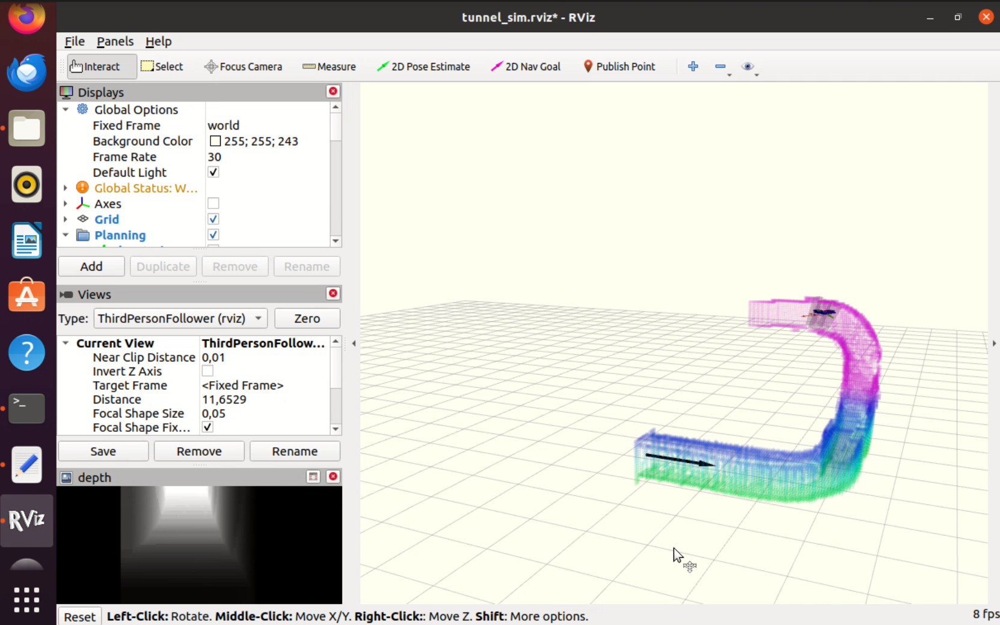
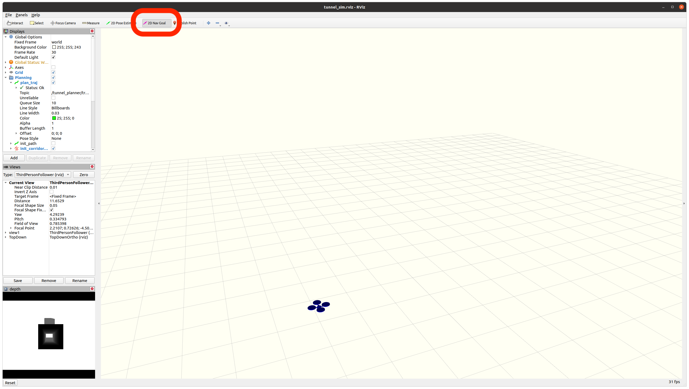
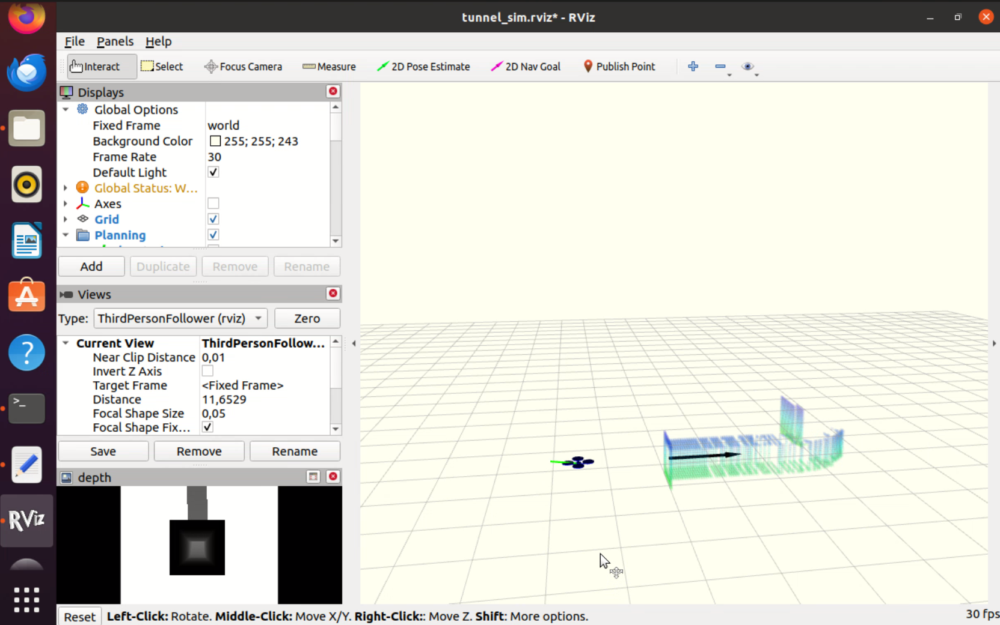

<!-- SECTION 1: INTRODUCTION -->

# Recent Developments in the field of AI-native Autonomous UAV Vehicles

The domain of autonomous micro aerial vehicle (MAV) navigation is currently witnessing a divergence in engineering philosophy, driven by the starkly different requirements of operating environments. The challenges posed by unstructured, clutter-rich environments such as forests or collapsed buildings are fundamentally different from those found in structured, confined infrastructure like sewage tunnels or ventilation shafts.

In unstructured environments, the primary operational metric is latency. A drone flying at high speeds through a forest must perceive thin obstacles like tree branches and execute evasive maneuvers in milliseconds. The traditional robotic pipeline, which cascades through distinct modules for state estimation, dense mapping, trajectory planning, and control, often introduces a computational latency that imposes a theoretical speed limit on the system. Furthermore, the explicit reconstruction of a map is often computationally prohibitive on the lightweight hardware required for agile flight. This has led to the emergence of end-to-end learning methodologies, where the mapping from sensory input to control output is compressed into a single neural network. The work by Zhang et al. represents the cutting edge of this philosophy, utilizing "differentiable physics" to bridge the gap between simulation and reality.

Conversely, confined infrastructure environments present a challenge of aerodynamic stability and geometric precision. In a tunnel with a diameter of fewer than 0.6 meters, a multirotor is subjected to significant aerodynamic disturbances known as the "wall effect" or "ceiling effect." The air displaced by the propellers interacts with the tunnel surfaces and recirculates, creating a turbulent flow field that can destabilize the aircraft and suck it towards the walls. A neural network trained in a vacuum or a simplified physics simulator would likely fail in this environment because it lacks an inherent understanding of fluid dynamics. Therefore, the solution requires an explicit modeling approach. The work by Wang et al. represents this philosophy, employing a sophisticated modular pipeline that integrates aerodynamic disturbance models derived from fluid dynamics simulations directly into the motion planner.

This report serves to deconstruct these two methodologies. We will analyze the mathematical machinery that allows Zhang et al. to train agile policies without expert demonstrations, and we will examine the fluid dynamics modeling and optimization framework that enables Wang et al. to navigate tunnels that are barely wider than the drone itself. Finally, we will assess the feasibility of deploying these systems in the current technological and economic landscape.

## FINT Demo Using RViz

<div style="max-width: 100%; margin: 1.5em 0; text-align: center;">
  <video controls style="width: 100%; height: auto; border-radius: 10px; box-shadow: 0 4px 12px rgba(0,0,0,0.2);">
    <source src="_static/videos/fint_demo2_main_web.mp4" type="video/mp4">
    Your browser does not support the video tag.
  </video>
</div>

<!-- SECTION 2: DiffPhysDrone - DIFFERENTIABLE PHYSICS -->

# DiffPhysDrone: Agile Flight via Differentiable Physics

The methodology proposed by Zhang et al. fundamentally reimagines the robot learning pipeline. Traditional reinforcement learning (RL) treats the environment and the robot's dynamics as a "black box." The algorithm tries an action, observes the reward, and estimates the gradient to improve the policy. This process is sample-inefficient and often unstable. Zhang et al. replace the black box with a "white box": a physics simulator where every operation is differentiable.

## Differentiable Simulation Dynamics

The cornerstone of this approach is the ability to propagate the gradient of the loss function back through the simulator to the policy parameters. To make this computationally feasible for long training horizons, the researchers approximate the quadrotor dynamics using a point-mass model. While a full rigid-body model would capture rotational dynamics, the point-mass approximation provides a sufficiently accurate gradient direction for trajectory generation while significantly reducing the vanishing gradient problem.

The system is modeled as a discrete-time dynamical system. The state vector $x_k$ comprises the position $p_k$ and velocity $v_k$. The control input $u_k$ represents the desired thrust acceleration. The state evolution is governed by the numerical integration of the total acceleration $a_k$, which includes the thrust and a quadratic air drag term:

$$
\mathbf{v}_{k+1} = \mathbf{v}_k + \frac{\mathbf{a}_k + \mathbf{a}_{k+1}}{2}\Delta t
$$

$$
\mathbf{p}_{k+1} = \mathbf{p}_k + \mathbf{v}_k + \frac{1}{2}\mathbf{a}_k \Delta t^2
$$

A critical aspect of the simulation-to-reality transfer is the modeling of actuation latency. Physical motors and Electronic Speed Controllers (ESCs) do not respond instantly to commands. To capture this, the simulator passes the neural network's output through a differentiable filter that mimics the system's first-order response and delay $\tau$:

$$
\eta(t) = \begin{cases} 0, & t < \tau \\ \lambda e^{-\lambda(t-\tau)}, & t \geq \tau \end{cases}
$$

This convolution operation ensures that the gradients backpropagated through the physics engine account for the fact that a command issued at time $t$ will not physically manifest until time $t+\tau$.

## Analytic Gradient Propagation with Temporal Decay

The training process involves minimizing a cumulative loss function $\mathcal{L}_\theta$ over a horizon $N$. Because the simulator is differentiable, the gradient $\nabla_\theta \mathcal{L}_\theta$ can be computed analytically using the chain rule through time (Backpropagation Through Time, or BPTT).

However, backpropagating through hundreds of physics steps leads to a phenomenon known as gradient explosion, where the gradient values become exponentially large, destabilizing the neural network weights. Furthermore, in a navigation task, the robot should prioritize immediate threats over distant, uncertain obstacles. To address both issues, the authors introduce a temporal gradient decay mechanism. They multiply the gradient at each step by an exponential decay factor $e^{-\alpha \Delta t}$.

The resulting gradient computation is formulated as:

$$
\frac{\partial \mathcal{L}_\theta}{\partial \theta} = \frac{1}{N} \sum_{k=0}^{N-1} \left( \sum_{i=0}^k \frac{\partial l_k}{\partial \mathbf{x}_k} \prod_{j=i+1}^k \left( \frac{\partial \mathbf{x}_j}{\partial \mathbf{x}_{j-1}} e^{-\alpha \Delta t} \right) \frac{\partial \mathbf{x}_i}{\partial \theta} + \frac{\partial l_k}{\partial \mathbf{u}_k} \frac{\partial \mathbf{u}_k}{\partial \theta} \right)
$$

Here,

$$
\frac{\partial \mathbf{x}_j}{\partial \mathbf{x}_{j-1}}
$$

is the Jacobian of the dynamics function. The decay term ensures that the influence of a state $\mathbf{x}_j$ on an earlier action $u_i$ diminishes as the time gap increases. This effectively focuses the attention of the optimization on the immediate future, resulting in a robust and reactive flight policy.

## Perception Architecture and Implicit State Estimation

The flight policy is parameterized by a lightweight neural network that processes visual data and state information. The input consists of a depth image from the onboard camera. To ensure high-speed processing on low-cost hardware, the depth image is max-pooled to an extremely low resolution of $16 \times 12$ pixels. This drastic downsampling acts as a spatial filter, preserving the presence of obstacles while discarding high-frequency noise and texture details that are irrelevant for collision avoidance.

The network architecture incorporates a Gated Recurrent Unit (GRU). The inclusion of a recurrent layer is structurally necessary because the system does not use an explicit mapping module. The GRU maintains a hidden state vector that acts as a temporal memory. This memory allows the network to implicitly estimate the robot's velocity from the sequence of depth images (optical flow) and to retain information about obstacles that have recently passed out of the camera's field of view. This "implicit" state estimation removes the need for computationally expensive Visual-Inertial Odometry (VIO) algorithms, contributing to the system's low latency.

## Physics-Driven Loss Formulation

The objective function $L$ acts as the reward signal for the optimization. It is a weighted sum of velocity tracking, obstacle avoidance, and control smoothness:

$$
L = \lambda_v \mathcal{L}_v + \lambda_c \mathcal{L}_c + \lambda_a \mathcal{L}_a + \lambda_j \mathcal{L}_j
$$

The obstacle avoidance term $\mathcal{L}_c$ is mathematically designed to be permissive of agility. It uses a barrier function based on the distance to the nearest obstacle $d_k$ and the robot radius $r_q$. Crucially, this penalty is modulated by the approach velocity $v_k^c$:

$$
\mathcal{L}_c = \frac{1}{T} \sum_{k=1}^T \left[ v_k^c \cdot \max(1 - (d_k - r_q), 0)^2 + \beta_1 \ln(1 + e^{\beta_2 (r_q - d_k)}) \right]
$$

By multiplying the barrier penalty by the approach velocity $v_k^c$, the loss function only penalizes the drone if it is actively moving *towards* a collision. If the drone is flying very close to a wall but moving parallel to it (where $v_k^c \approx 0$), the penalty is minimal. This allows the agent to learn aggressive maneuvers in tight spaces, significantly outperforming traditional planners that enforce conservative safety margins.

<!-- SECTION 3: FINT - DISTURBANCE-AWARE PLANNING -->

# FINT: Disturbance-Aware Navigation in Confined Spaces

The methodology developed by Wang et al. targets a completely different use case, that is, narrow tunnels and pipes. In these environments, the assumption of free-stream aerodynamics breaks down. The proximity of the walls creates a complex interaction between the propeller downwash and the environment.

## Aerodynamic Modeling via Computational Fluid Dynamics

To fly safely in a tunnel with a diameter of 0.5 meters, the control system must anticipate the aerodynamic forces that attempt to destabilize the aircraft. The researchers identified that standard proximity effect models (like ground effect equations) were insufficient for the complex curvature of tunnels. Consequently, they turned to Computational Fluid Dynamics (CFD).

The team conducted a massive offline simulation campaign, generating 2,940 unique cases. These simulations varied the tunnel shape (circular vs. rectangular), the flight speed, the pitch angle of the drone, and the distance to the walls. The goal was to quantify the "Ego-Airflow Disturbance," which they defined via a metric called the Ego-Airflow Disturbance Level (EDL). The EDL represents the ratio of turbulent, reflected airflow entering the propellers to the total airflow intake:

$$
\text{EDL} = \frac{\text{Turbulent Flow Intake}}{\text{Total Propeller Intake}}
$$

Since running a CFD simulation takes hours and the drone needs to make decisions in milliseconds, the researchers trained a neural network surrogate model. Initially, they used a General Regression Neural Network (GRNN) and later a Multi-Layer Perceptron (MLP) to learn the mapping from the drone's state (speed, position in tunnel) to the EDL value. This allows the onboard computer to query the expected aerodynamic disturbance instantaneously during flight.

## Virtual Omnidirectional Perception

Navigating a tunnel requires a comprehensive understanding of the surrounding geometry. A standard forward-facing camera is insufficient because it cannot simultaneously see the floor, ceiling, and walls to ensure the drone is centered. To solve this, the authors engineered a "Virtual Omnidirectional Perception" system.

The hardware implementation utilizes three Intel RealSense cameras mounted in a specific configuration: one facing forward, one facing up, and one facing down. The depth data from these cameras is fused into a local map. However, simply having the cameras is not enough; the drone must know where to look. The system implements an "Active Yaw Planning" strategy. When the planner detects a turn in the tunnel, it calculates a desired yaw angle $\mathbf{y}_d$ that aligns the drone's sensing array with the curvature of the tunnel. The yaw reference is computed based on the center of curvature $\mathbf{r}_h$:

$$
\mathbf{y}_{d} = \mathbf{y}_{0} + k_r \frac{\mathbf{r}_{h}}{|\mathbf{r}_{h}|^2}
$$

This active perception strategy ensures that the drone maximizes its look-ahead distance and never flies blind into a sharp corner.

## Optimization-Based Motion Planning

The core of the navigation stack is a trajectory optimization algorithm that generates a B-spline path. Unlike the neural network policy of Zhang et al., this is a deterministic algorithm that solves a mathematical optimization problem to minimize a cost function $\mathcal{G}(T)$.

The cost function is meticulously designed to handle the specific constraints of tunnel flight. It includes terms for control effort and smoothness, but adds two novel penalties:

$$
\mathcal{G}(T) = \int_0^T \left( |\mathbf{u}(t)|^2 + \lambda_{of} \hat{v}_{of}(t)^2 + \lambda_{ed}|\text{EDL}(t)|^2 \right) dt + \rho T
$$

The term $\lambda_{of}\, \hat{v}_{of}(t)^{2}$ penalizes the optical flow speed.
In a narrow tunnel, if the drone flies too fast near the wall, the texture on the wall moves across the camera sensor too quickly, which causes motion blur. This motion blur degrades the performance of visual-inertial odometry (VIO) and leads to state estimation drift. By penalizing high optical flow, the planner forces the drone to slow down in narrow sections of the tunnel, thereby preserving perception quality.

<!-- SECTION 4: COMPARATIVE ENGINEERING ANALYSIS -->

# Comparison of Methods

To provide a clear distinction between the two architectures, we present a detailed comparison of their technical specifications and performance characteristics.

| **Parameter** | **DiffPhysDrone (Zhang et al.)** | **FINT (Wang et al.)** |
| :--- | :--- | :--- |
| **Control Paradigm** | End-to-End Neural Policy (CNN+GRU) | Modular Pipeline (Map-Plan-Control) |
| **Primary Environment** | Unstructured Clutter (Forests) | Structured Confined Spaces (Tunnels) |
| **Computational Hardware** | Mango Pi MQ-Quad (Allwinner H616) | Nvidia Orin NX (Ampere GPU) |
| **Compute Cost (Approx.)** | US$21 | US$600+ |
| **Primary Sensor** | 1x Intel RealSense D435i (Stereo) | 3x Intel RealSense L515 (LiDAR) |
| **State Estimation** | Implicit (Learned from Depth) | Explicit RGBD-Inertial Odometry |
| **Mapping Strategy** | None (Reactive Memory) | Euclidean Distance Field (EDF) |
| **Aerodynamic Handling** | Implicit Robustness via Sim | Explicit CFD-based Neural Model |
| **Maximum Flight Speed** | 20 m/s | Approx. 2--3 m/s |
| **System Weight** | 365g | 1085g |
| **Collision Avoidance** | Probabilistic | Deterministic Optimization |

*Table 1: Detailed Technical Comparison of Navigation Architectures*

The comparison highlights a fundamental trade-off. DiffPhysDrone achieves superior agility and cost-efficiency by sacrificing interpretability and deterministic safety guarantees. It relies on the statistical probability that the neural network has generalized well enough to avoid collisions. FINT achieves high safety and robustness in hostile aerodynamic conditions by sacrificing speed and significantly increasing the cost and complexity of the hardware.

# FINT Explanation & Implementation

This section describes the FINT system, which is an autonomous aerial navigation framework designed for flying quadrotors inside narrow tunnels. The system is based on the research paper titled *Autonomous Flights Inside Narrow Tunnels*, published in IEEE Transactions on Robotics. The main goal of this work is to enable fully autonomous flight in real tunnel environments that are extremely constrained, with tunnel diameters as small as 0.5 meters and with arbitrary tunnel shapes and directions.

FINT is, to the best of our knowledge, the first autonomous quadrotor system that has been demonstrated to fly inside real-world tunnels with such tight geometric constraints. The system focuses on robustness, perception reliability, and safe motion planning under limited sensing and strong environmental disturbances.


*Tunnel flight simulation visualized in RViz*

## System Overview

The FINT framework is organized as a set of ROS-based modules that work together during autonomous flight. At a high level, the system combines a simulator, a tunnel-aware planner, a state estimation module, and custom message definitions. These components communicate through ROS topics and services and are designed to run in real time.

In our setup, the entire system is deployed on Ubuntu 20.04 LTS with ROS1 Noetic, running inside a virtual machine. This setup closely matches the environment used by the original authors and ensures compatibility with all dependencies.

## Main Components

The UAV simulator provides a controlled environment where perception and motion can be tested without real hardware. It simulates both the vehicle dynamics and the tunnel geometry, allowing the planner to operate as if it were flying in a real tunnel.

The tunnel planner is the core of the system. It performs map fusion and generates safe trajectories by considering both perception uncertainty and aerodynamic disturbances. Unlike open-space planners, this planner explicitly accounts for tunnel walls and tight clearances.

VINS-Multi is an optional but important component for real-world deployment. It is a visual-inertial state estimator that fuses data from multiple cameras and an IMU to estimate the drone’s position, velocity, and orientation. In simulation, this module is not required, but it becomes critical when flying on real hardware.

Custom quadrotor message definitions are used to support communication between modules. These messages extend standard ROS message types to better represent the needs of tunnel flight, such as trajectory constraints and planner outputs.

## What NLopt Is and Why It Is Needed

NLopt is an open-source numerical optimization library used for solving nonlinear optimization problems. In the context of FINT, NLopt is used inside the planner to optimize trajectories under constraints. These constraints include collision avoidance, smoothness, and feasibility within narrow tunnels.

Without NLopt, the planner cannot solve the optimization problems required to generate safe and smooth flight trajectories. This is why NLopt version 2.7.1 is a required dependency for building and running the system.

## Simulation Setup

All experiments in this work are conducted on Ubuntu 20.04 LTS with ROS Noetic, running inside a virtual machine. The simulation setup does not require the VINS-Multi submodule, which simplifies initial testing.

After creating a catkin workspace, the repository is cloned into the `src` directory. The workspace is then built using `catkin_make`, and the environment is sourced.

```bash
cd catkin_ws_fint/src
git clone https://github.com/HKUST-Aerial-Robotics/FINT.git
cd ..
catkin_make
source devel/setup.bash
```

Once the build is complete, the simulation can be launched. First, RViz is opened to visualize the environment. Then, the simulator and planner are started.

In two separate terminals, we shall run the following commands to open RViz and make the environment ready for testing.

```bash
roslaunch tunnel_planner tunnel_sim_rviz.launch
roslaunch tunnel_planner drone_small_sim.launch
```

In RViz, the flight is initiated by selecting the `2D Nav Goal` tool or pressing the `G` key and clicking a target point. The drone then autonomously plans and executes a trajectory through the tunnel.


*2D Nav Goal*

Different tunnel shapes are supported by modifying the `simulator.xml` configuration file. The repository includes several predefined tunnel geometries, such as circular and rectangular tunnels, as well as sharp curved variants. These environments are useful for testing planner robustness under different geometric constraints.


*Tunnel flight simulation visualized in RViz*

## Real-World Deployment with VINS-Multi

For real UAV deployment, the VINS-Multi submodule must be pulled and built. This module provides accurate state estimation using camera and IMU data, which is essential when flying in real tunnels where GPS is unavailable.

```bash
mkdir catkin_ws_fint
cd catkin_ws_fint/src/FINT
git pull --recurse-submodules
```

After pulling the submodule, the installation instructions provided in the VINS-Multi repository should be followed. Once configured, the estimator can be integrated with the planner to enable real-world autonomous tunnel flight.

<!-- SECTION 5: FEASIBILITY AND REAL-WORLD DEPLOYMENT -->

# Feasibility and Real-World Deployment Assessment

This section translates the academic findings into a practical assessment for engineering teams looking to deploy these technologies. We analyze supply chain risks, hardware availability, and operational suitability.

## Hardware Availability and Supply Chain Vulnerabilities

A critical feasibility finding concerns the sensor suite utilized in FINT (Wang et al.). The "Virtual Omnidirectional Perception" system is architected around the **Intel RealSense L515** LiDAR camera. This sensor was chosen for its high precision and ability to operate in the textureless, low-light conditions typical of tunnels.

However, based on verified market data, Intel issued an End-of-Life (EOL) notice for the RealSense L515 product line in August 2021, with the final shipment date occurring in September 2022. This renders the hardware architecture of FINT strictly non-replicable for mass production or new fleet deployments using off-the-shelf components. An engineering team attempting to adopt this approach would face significant non-recurring engineering (NRE) costs to redesign the perception frontend. Viable alternatives, such as the Livox Mid-360 or Unitree L1, possess different form factors, weights, and minimum sensing ranges (blind spots), which would necessitate a complete redesign of the drone frame and a recalibration of the center of mass.

In contrast, DiffPhysDrone relies on the **Mango Pi MQ-Quad** and the **Intel RealSense D435i**. The Mango Pi is a widely available commodity single-board computer featuring a standard Allwinner H616 SoC. The RealSense D435i remains a staple in the robotics inventory with stable availability. Consequently, DiffPhysDrone presents a highly robust and sustainable supply chain profile.

## Computational and Power Constraints

DiffPhysDrone demonstrates exceptional power efficiency. By eliminating the mapping and planning stacks, the neural policy consumes negligible power on the ARM Cortex-A53 cores. This conservation of energy allows the majority of the battery capacity to be directed toward propulsion, facilitating high-speed flight (20 m/s) and longer mission endurance.

FINT imposes a severe computational penalty. The Nvidia Orin NX operates with a Thermal Design Power (TDP) of 10W to 25W. On a 1kg quadrotor, this power draw is significant. Furthermore, the requirement to run three concurrent Visual-Inertial Odometry (VIO) instances, along with real-time mapping and non-linear optimization, generates substantial heat, necessitating active cooling solutions that add weight and vibration. This limits the system's flight time and operational range, confining it to short-duration inspection sorties rather than wide-area surveys.


# Video Demonstration of FINT Running on Ubuntu 20.04 LTS VM

Although the video was recorded using GStreamer, there were significant frame drops which is very expected because this is running on a virtual machine.

## Another Demo

<div style="max-width: 100%; margin: 1.5em 0; text-align: center;">
  <video controls style="width: 100%; height: auto; border-radius: 10px; box-shadow: 0 4px 12px rgba(0,0,0,0.2);">
    <source src="_static/videos/fint_demo_web.mp4" type="video/mp4">
    Your browser does not support the video tag.
  </video>
</div>


<!-- SECTION 6: CONCLUSION -->

# Conclusion

This report has provided a comprehensive analysis of two divergent approaches to autonomous flight. The research by Zhang et al. validates the efficacy of Differentiable Physics as a tool for democratizing agile flight. By compressing the navigation stack into a neural network trained with analytic gradients, they have demonstrated that superhuman agility is achievable on hobbyist-grade hardware. This offers a feasible path for the mass deployment of autonomous swarms in unstructured environments.

Conversely, the work by Wang et al. reinforces the necessity of Physics-Aware Planning in hazardous environments. Their research proves that in confined spaces, aerodynamic interactions cannot be ignored or implicitly learned; they must be explicitly modeled and avoided. The integration of CFD-derived disturbance models into a modular planner provides the safety guarantees required for industrial applications. However, the reliance on obsolete sensor hardware presents a significant barrier to immediate commercial adoption, requiring a strategic redesign of the perception layer for future deployments.
